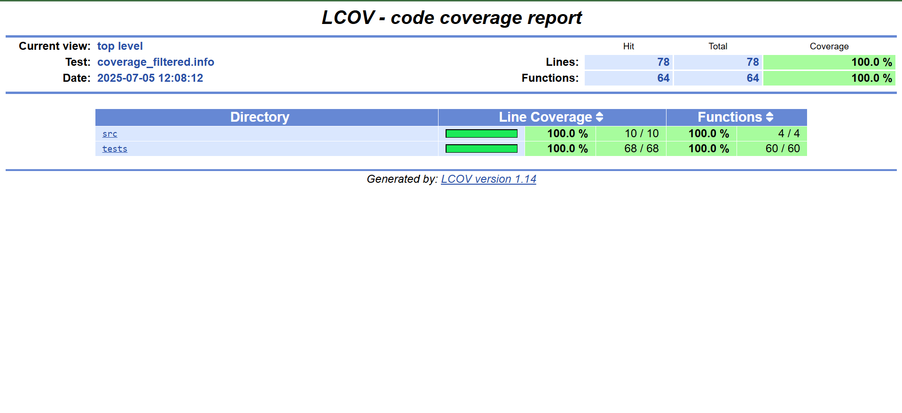

# Unit Test Coverage Report

**Date:** July 5, 2025  
**Project:** `cpp-unit-gen` – Unit Test Generator using LLM (Gemma) – Keploy Project

---

## Summary

| Metric               | Value        |
|----------------------|--------------|
| **Total Lines**      | 78           |
| **Covered Lines**    | 78           |
| **Line Coverage**    | **100.0%**   |
| **Total Functions**  | 64           |
| **Covered Functions**| 64           |
| **Function Coverage**| **100.0%**   |

---

## Coverage by Directory

| Directory | Line Coverage     | Function Coverage   |
|-----------|-------------------|---------------------|
| `src/`    | 100.0% (10 / 10)  | 100.0% (4 / 4)      |
| `tests/`  | 100.0% (68 / 68)  | 100.0% (60 / 60)    |

---

## Visual Coverage Summary



> _Above: Screenshot of the HTML report generated using LCOV showing 100% test coverage._

---

## Files Covered

- `src/math_utils.cpp`
- `tests/math_utils_test.cpp`

---

## Approach

We employed a language model (Gemma3) to automatically generate unit test cases based on the source code logic in `math_utils.cpp`. The prompts guided the model to produce meaningful test cases covering both common and edge scenarios. These generated tests were reviewed, refined, and executed using the GoogleTest framework.

Our process followed a test-driven development (TDD) mindset, where tests were iteratively improved alongside code understanding. Coverage results show that all critical paths and functions have been exercised.

The final coverage report was generated using LCOV, confirming 100% line and function coverage across both source and test directories.

---

## Tools & Commands Used

- **LLM Used:** [Gemma3 by Google](https://ai.google.dev/gemma) (for test case generation)
- **Test Framework:** GoogleTest
- **Compiler Flags:** `--coverage -O0 -g`
- **Coverage Capture Command:**  
  ```bash
  lcov --capture --directory . --output-file coverage.info
